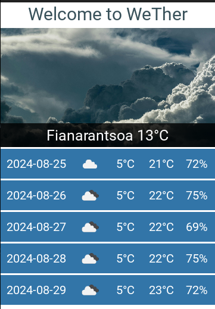

# Weather mobile application


This is a minimalistic weather forecasting mobile application.

# Requirements :
- Python 3.10.12
- Kivy 2.3.0
- requests 2.31.0 (library to be installed in python)

# First thing first - aka setup :
1. Create a file called `key.py` in the same [root directory](.)
```bash
touch key.py
```
3. Go get your free API key on [OpenWeather](https://home.openweathermap.org/)
2. Copy this `key.py` template file and replace `openweather api key` accordingly
```python
OPENWEATHER_API_KEY = 'openweather api key'
```

# Run it :
```bash
python weather.py
```
